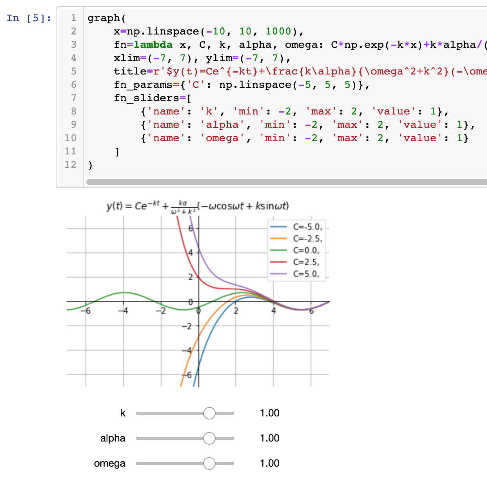
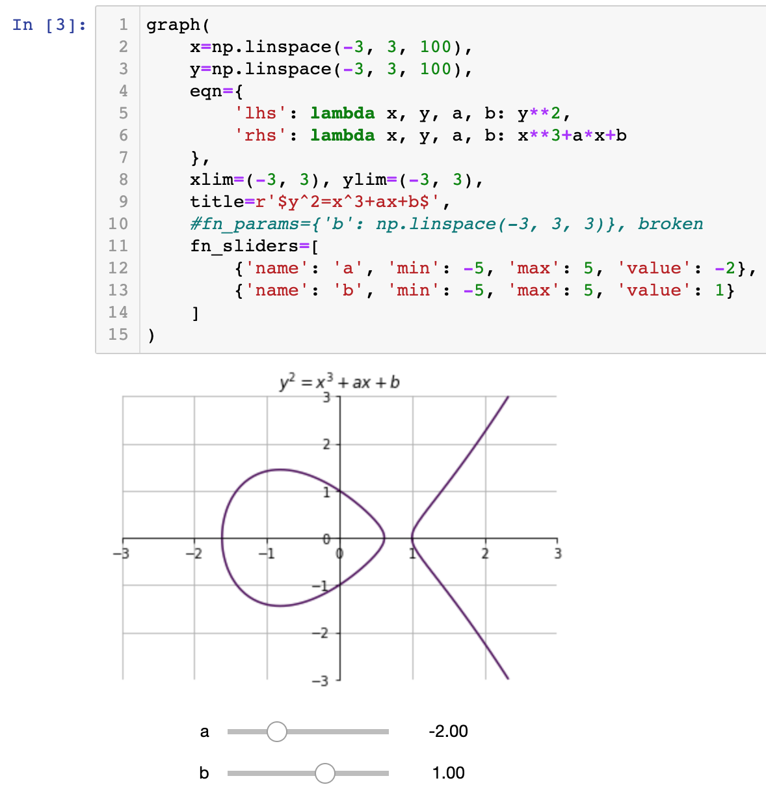
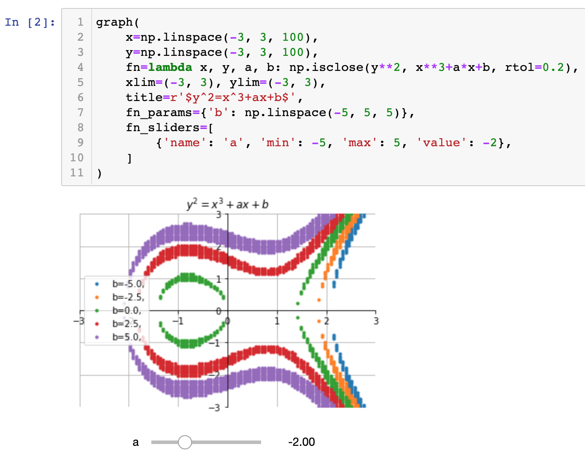
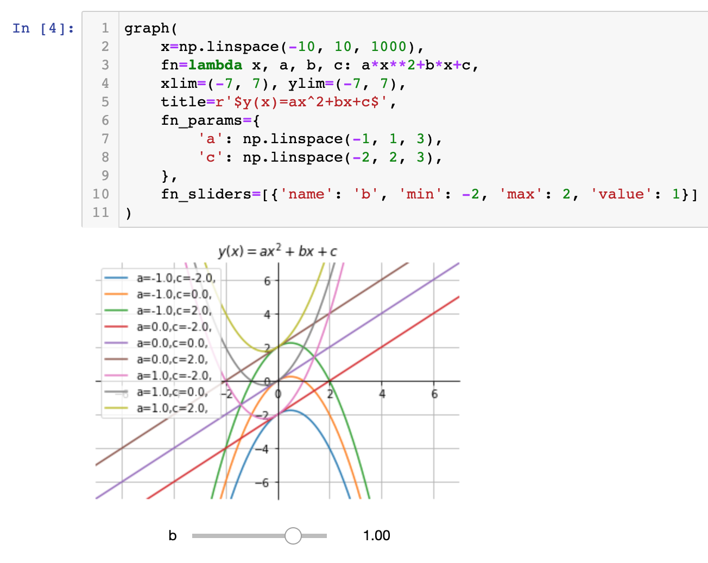

# grapher
2D matplotlib plotting of functions, implicit equations, binary relations

Graph a function

Graph an implicit equation

Graph a binary relation

Can plot all permutations of parameters

